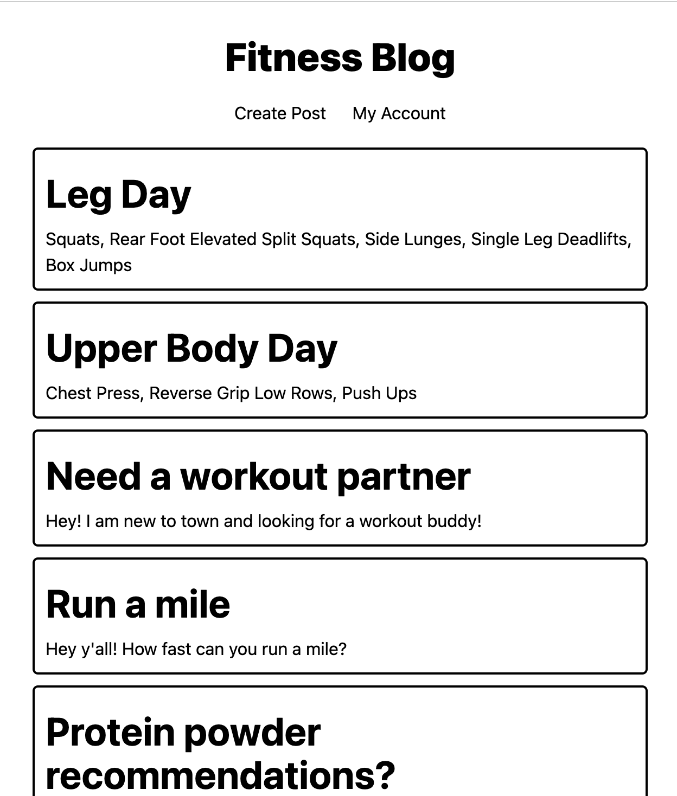
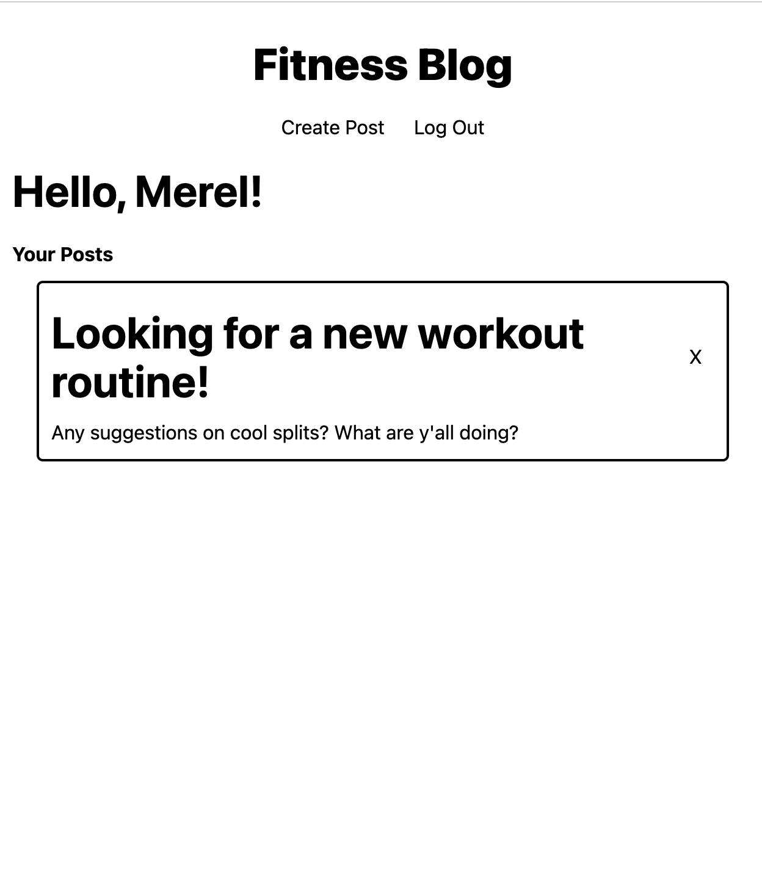
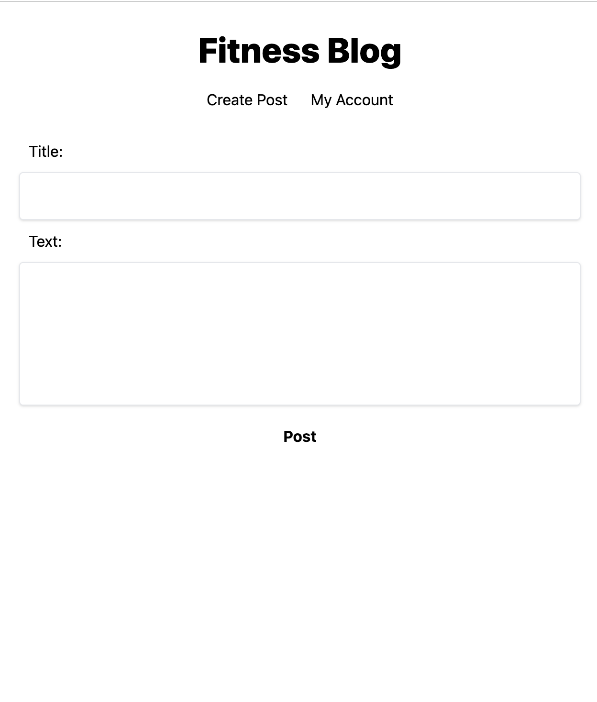

# Fitness Blog

A fitness blog website where users can share their fitness experiences, tips, and insights.

## Table of Contents

- [Description](#description)
- [Features](#features)
- [Dependencies](#dependencies)
- [Installation](#installation)
- [Usage](#usage)
- [Technologies](#technologies)
- [Contributing](#contributing)
- [License](#license)
- [Contact](#contact)

## Description

Fitness Blog is a web application that allows users to create, view, and interact with fitness-related blog posts. Users can sign up, log in, create posts, leave comments, and engage in discussions around various fitness topics.

Home Page: 

[Video Walkthrough](https://drive.google.com/file/d/1W8NBCEYT5lCEG9Xudhbbkapa16KFOk6V/view)

Your account:

Create post:

## Features

- User authentication and registration
- Create, edit, and delete blog posts
- Leave and delete comments on blog posts
- User profiles and activity tracking
- Responsive and user-friendly design

## Dependencies

- connect-session-sequelize: ^7.1.7
- dotenv: ^16.3.1
- express: ^4.18.2
- express-handlebars: ^7.1.1
- express-session: ^1.17.3
- mysql2: ^3.6.0
- sequelize: ^6.32.1

## Installation

1. Clone the repository
2. Navigate to the project directory
3. Install dependencies: `npm install`
4. Set up your environment variables: Create a `.env` file and add your database credentials.

## Usage

1. Start the server: `npm start`
2. Open your web browser and visit: `http://localhost:3002`

## Technologies

- Node.js
- Express.js
- Sequelize (MySQL database)
- Handlebars (templating engine)
- Front-end technologies (HTML, CSS, JavaScript)

## Contributing

Contributions are welcome! If you find a bug or have an enhancement in mind, please open an issue or submit a pull request.

## License

This project is licensed under the [MIT License](LICENSE).

## Contact

For questions or inquiries, please contact [Merel Jac](mailto:merel.burleigh@gmail.com).

